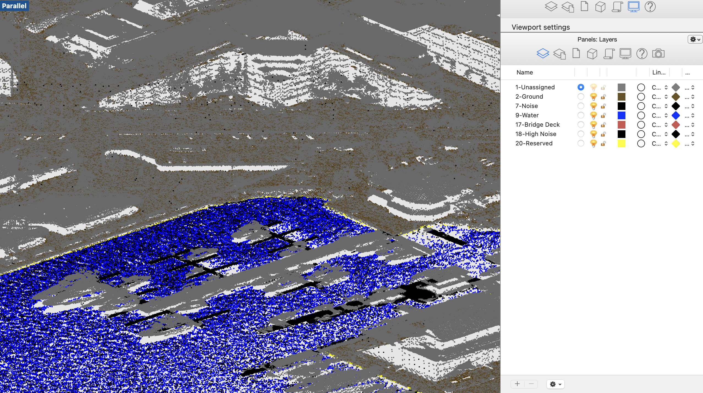

# LAS_to_Rhino_3DM
Read a .LAS point cloud file and create a Rhino .3DM file with point clouds organized by classification code.

**How to Use**
1. If you do not have a Rhino license, you'll need to purchase one from: https://www.rhino3d.com/

2. Install laspy, numpy and rhino3dm. If you have problems with rhino3dm, then set up a conda environment and `pip install rhino3dm`

3. Update the file path for las_filepath to the file path for your .LAS file.

4. Update the constants file to whichever classification codes you would like to extract from the .LAS file.

5. You should be ready to run the program. The program will output a Rhino .3DM file to your project folder for Rhino version 7.

**Example Output**

